# PROJECT CONTRACT
## Evidence-Aware Tiger Camera-Trap Movement Intelligence System

Version: 1.0
Status: MVP CONTRACT

---

## 1. PROJECT OBJECTIVE

Build a working prototype for:

Evidence-aware camera-trap triage, individual tiger identity
decision-making, trusted longitudinal history, movement analysis,
and alert management.

The project does NOT claim to invent:

- tiger detection;
- tiger Re-ID;
- stripe recognition;
- visual embeddings;
- GPS/time fusion;
- uncertainty estimation;
- abstention;
- GIS;
- home-range analysis.

The central experimental question is:

> Does an identity-gating layer, calibrated for the cost of false
> identity assignments, reduce downstream movement-alert errors
> compared with an always-assign pipeline under camera-trap domain
> shift and survey artefacts?

---

# 2. DEVELOPMENT PRIORITY

Everything must be developed in this order:


If time becomes limited, **P2 and P3 features are removed first**.

**P0 must never be sacrificed for advanced features.**

---

# 3. THREE-DEVELOPER ARCHITECTURE

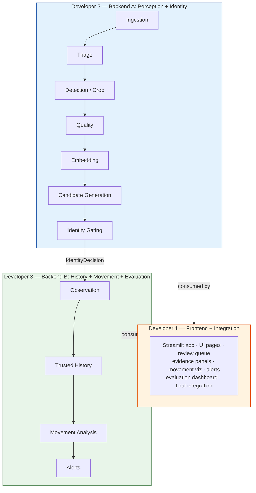

**Developer 1** does NOT implement ML algorithms.

**Developer 2** outputs: `IdentityDecision`

**Developer 3** is also responsible for **Baseline vs Evidence-Gated evaluation**.

---

# 4. INTEGRATION CONTRACT

All developers MUST use:

`src/schemas.py`

as the single source of truth.

Do not independently redefine data structures.

### Core data flow

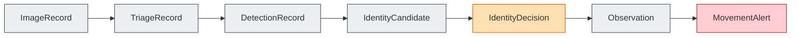

---

# 5. CRITICAL SAFETY RULE

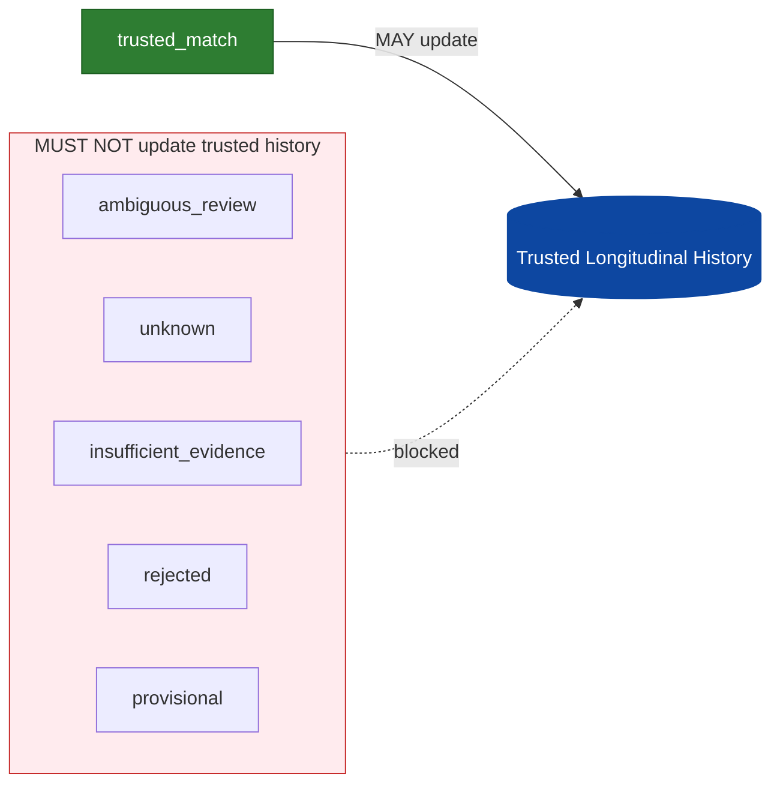

**ONLY** `trusted_match` may update trusted longitudinal history.

Uncertain observations may be displayed and reviewed but cannot
silently contaminate trusted history.

---

# 6. P0 MVP

The first working version must:

1. process an image folder;
2. create image records;
3. perform blank/nonblank triage;
4. produce detection/crop or deterministic demo equivalent;
5. generate candidate identities;
6. produce identity decisions;
7. route uncertain cases;
8. update trusted history only for trusted matches;
9. calculate basic movement deviation;
10. generate or suppress an alert;
11. explain the decision;
12. compare always-assign vs evidence-gated behaviour;
13. run without GPU.

---

# 7. DEMO-FIRST RULE

The system MUST work without a real tiger dataset.

Create a clearly labelled DEMO MODE.

Demo mode may use:

- synthetic metadata;
- controlled scenarios;
- deterministic candidate scores;
- sample images;
- simulated movement observations.

**Demo data MUST NEVER be presented as real Pench observations.**

Real public datasets can be integrated later.

Development must NOT stop while waiting for a perfect dataset.

---

# 8. BASELINE

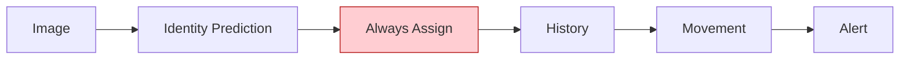

This is the baseline.

---

# 9. PROPOSED SYSTEM

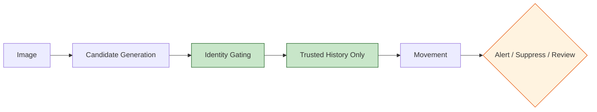

---

# 10. EVALUATION

Compare the baseline and proposed system on the same scenarios.

Measure where labels permit:

- false confident identity rate;
- coverage;
- abstention/review rate;
- selective risk;
- false movement-alert rate;
- alert precision;
- artefact suppression;
- observations prevented from entering trusted history.

**Never fabricate results.**

---

# 11. IDENTITY STATES

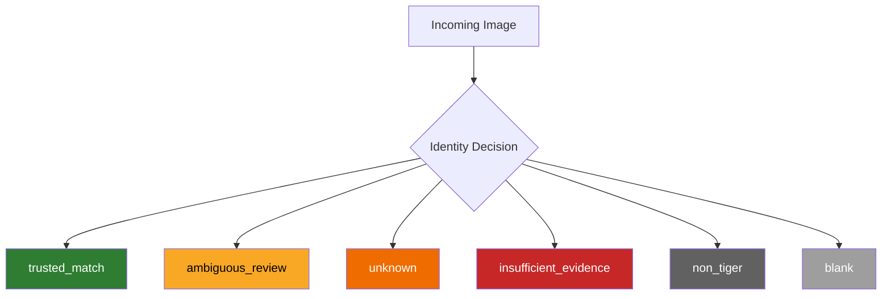

Every decision must contain:

- confidence;
- reason codes;
- evidence summary;
- top candidates;
- `update_history`.

---

# 12. PROTOTYPE EVIDENCE SCORE

Initial configurable heuristic:

```
E = 0.55V + 0.15Q + 0.15S + 0.10T + 0.05H
```

| Symbol | Meaning |
|---|---|
| V | visual evidence |
| Q | image quality |
| S | spatial feasibility |
| T | temporal feasibility |
| H | history consistency |

These weights are **prototype heuristics**. They are **NOT** scientifically validated parameters.

Thresholds must be configurable.

---

# 13. MOVEMENT TERMINOLOGY

Unless a scientifically validated home-range method is implemented,
use:

> "historical capture area"

instead of:

> "validated home range".

Never claim behavioural change from one isolated observation.

---

# 14. ALERT TYPES

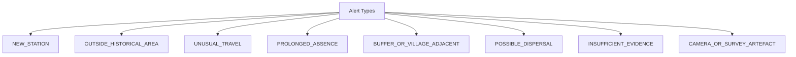

Alerts must distinguish:

- likely biological signal;
- likely observation artefact;
- insufficient evidence;
- human review required.

---

# 15. ALERT SUPPRESSION

Downgrade or suppress alerts when:

- identity confidence is insufficient;
- camera was relocated;
- camera effort is insufficient;
- image quality is poor;
- history is too short;
- metadata are missing;
- only one isolated observation exists.

---

# 16. TECHNOLOGY

**Preferred:**

- Python 3.11+
- Streamlit
- pandas
- NumPy
- Pydantic
- SQLite
- OpenCV
- Pillow
- scikit-learn
- Plotly
- PyTorch/torchvision

**Optional:**

- OpenCLIP
- Ultralytics YOLO
- GeoPandas
- Shapely
- pyproj
- Folium/PyDeck
- FAISS

No component may require a GPU.
No paid API.
No cloud-only dependency.
No large-model training from scratch.
Every ML component needs a deterministic/demo fallback.

---

# 17. REPOSITORY STRUCTURE

```
project/
├── PROJECT_CONTRACT.md
├── README.md
├── requirements.txt
├── app.py
│
├── data/
│   └── demo/
│
├── src/
│   ├── schemas.py
│   ├── pipeline.py
│   │
│   ├── ingestion.py
│   ├── triage.py
│   ├── perception.py
│   ├── identity.py
│   ├── gating.py
│   │
│   ├── history.py
│   ├── movement.py
│   ├── alerts.py
│   └── evaluation.py
│
├── ui/
│   ├── overview.py
│   ├── processing.py
│   ├── review.py
│   ├── movement.py
│   ├── alerts.py
│   └── evaluation.py
│
└── tests/
```

---

# 18. OWNERSHIP

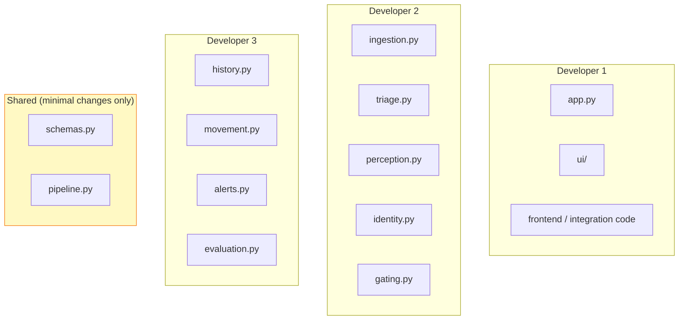

Any schema change must be communicated to all developers before merging.

---

# 19. SHARED INTERFACES

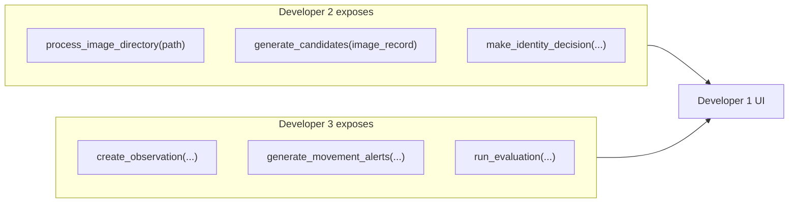

Developer 1 must consume these interfaces rather than reimplementing
their logic.

---

# 20. INTEGRATION ORDER


**Do NOT build the complete UI before the backend pipeline works.**

---

# 21. TESTING

Every developer must create unit tests.

At minimum:

- schema validation;
- candidate generation;
- identity decisions;
- trusted-only history;
- unknown handling;
- camera relocation;
- alert suppression;
- baseline vs gated comparison.

Run:

```
pytest
```

before merging.

---

# 22. GIT RULES

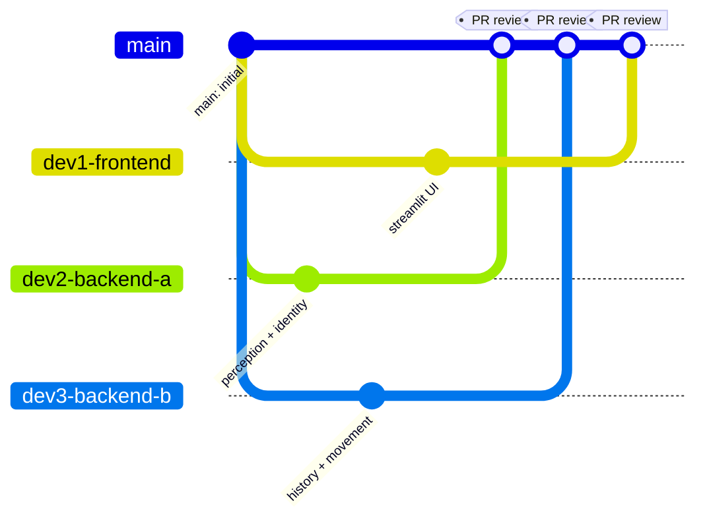

`main` is protected.

- Developers work only on their assigned branches.
- No direct pushes to `main`.
- All changes enter `main` through Pull Requests.
- Do not force-push shared branches.
- Do not rewrite another developer's code unnecessarily.

---

# 23. FEATURE PRIORITY

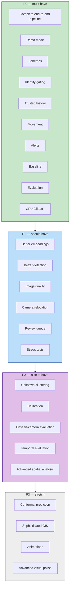

---

# 24. CUT RULE

If time is running out:

**CUT (in order):**

1. conformal prediction;
2. advanced GIS;
3. sophisticated clustering;
4. animations;
5. decorative UI.

**DO NOT CUT:**

1. identity gating;
2. trusted-only history;
3. baseline comparison;
4. alert suppression;
5. explanations;
6. demo fallback;
7. tests.

---

# 25. DEFINITION OF DONE

- application starts locally;
- images can be processed;
- blank images are quarantined;
- candidates are generated;
- uncertain identities can abstain;
- trusted identities update history;
- uncertain identities cannot contaminate history;
- movement deviations are detected;
- artefact alerts can be suppressed;
- decisions are explainable;
- baseline and gated systems can be compared;
- tests pass;
- system works without GPU;
- demo data are clearly labelled.

---

# 26. SCIENTIFIC HONESTY

Never claim:

- invented tiger Re-ID;
- invented stripe recognition;
- invented visual embeddings;
- invented GPS/time fusion;
- field validation without field data;
- real Pench performance without real Pench evaluation;
- scientifically validated home ranges from prototype data.

The project's defensible contribution is the evaluation of an
auditable identity-gating layer and its effect on downstream
longitudinal movement-alert reliability.

---

# 27. GOLDEN RULE

The objective is **NOT**:

> "assign an identity to every image."

The objective is:

> Know when the evidence is strong enough for an observation to
> influence a downstream management conclusion.
